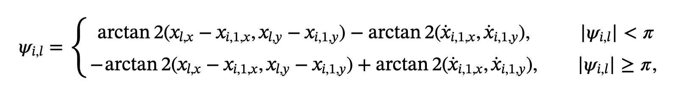
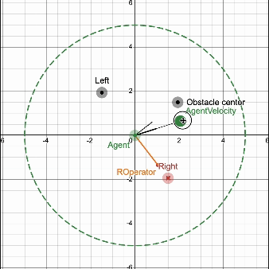
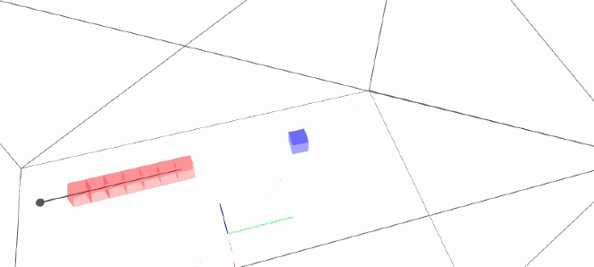

# Session notes (Oldest first )
---
## 💻 Session 2024-10-29: An Obstacle Avoidance Equation

### Objective: Study and understand an equation for obstacle avoidance.

I found a simple and "stable" equation for dodging behavior proposed by Ma and Chou (2024). Their paper addresses stability issues in multi-agent simulations (MAS) and proposes an equation to solve the minima problem. They created a *Rotation Operator* vector that pulls the agent away from the obstacle center based on the angle between the agent's velocity vector and the agent-to-obstacle vector.

Using this approach, the objective is to enable an agent to dodge an obstacle directly in front.

> ### What's the Minima Problem?
> When an agent in a simulation cannot resolve conflicting forces (e.g., collision avoidance, target following, obstacle avoidance) in a direction that would allow it to exit from a concave shape, it may get trapped or stop. This often happens in navigation simulations when the agents lack prior environmental knowledge, meaning a pathfinding algorithm is not feasible.


### Breaking Down the Rotation Operator

#### Variables:
- **Obstacle Center**: Position of the obstacle.
- **Agent Position**: Current position of the agent.
- **Agent Velocity**: Agent's directional movement vector.
- **Critical Radius**: Distance threshold to initiate avoidance behavior.

#### Steps:
1. **Distance Check**: Validate if the agent-to-obstacle distance is equal to or less than the Critical radius.
2. **Angle Comparison**:

Compare the angle between the agent's velocity (a) and agent-to-obstacle (ao) to determine if the obstacle is to the left and to the right. And here, I simplified the proposed method. The original compares the absolute rotation, and if it is greater than PI, computes the two different equations with arctan2 to determine whether the agent should turn to the left (obstacle to the right ) or to the right (obstacle to the left).



My simplification (considering a 2D avoidance) is as follows:

   - Normalize both vectors: $$\left(A\right)$$ (agent's velocity) and $$\left(O-A\right)$$ (agent-to-obstacle).
   - Ignore the Z component (UP) since this is a 2D rotation.
   - Compute a simplified cross-product to obtain the sign, indicating left or right orientation.
$$C_{ross}=\left(D_{irectionX}\ \cdot a_{toObstacleY}\ \right)-\left(D_{irectionY}\cdot a_{toObstacleX}\right)$$
3. With the orientation, create the rotation vector that is orthogonal to the object-to-agent (oa) vector by reflecting the component of "oa."

$$V_{rotationLeft}\ =\ \left(\left(x_{iy}\ -\ x_{ly}\right),\ -\left(x_{ix}\ -\ x_{lx}\right)\right)$$
$$V_{rotationRigth}\ =\ \left(-\left(x_{iy}\ -\ x_{ly}\right),\ \left(x_{ix}\ -\ x_{lx}\right)\right)$$
$$V_{rotation} = \begin{cases} 
      V_{rotationLeft} & \text{if } C_{ross} < 0 \\
      V_{rotationRigth} & \text{if } C_{ross} \geq 0 
   \end{cases}$$

4. Now that we have the direction to turn, we compute three things:
- Radial attenuation: This is an inverse relationship between the agent's position and the resulting value. It helps dampen the force of the rotation if the agent moves away from the obstacle.
- 
$$k_{radialAttenuation}=\left(\left(\frac{1}{r_{o}}\right)-\left(\frac{1}{r_{critical}}\right)\right)$$

- Rotation Velocity and Proximity Damping: This increases the force of the velocity the closer the agent gets and gives a smooth transition.

$$\frac{1}{\left(r_{o}^{2}\cdot V_{rotMagnitud}\right)}$$

- Amplitude coefficient This is a user-defined value that increases the force of the rotation operator.

$$K_{amplitud}=8$$

4. Lastly, Ma and Chou's Rotation Operator equation looks like this:

$$R_{operator}=K_{amplitud}\cdot\frac{1}{\left(r_{o}^{2}\cdot V_{rotMagnitud}\right)}\cdot k_{radialAttenuation}\cdot V_{rotation}$$



[Play this it in DESMOS](https://www.desmos.com/calculator/qc0rr7hacq)

### Next Steps
- **Implement in Code**: Outline steps for adding the rotation operator.
- **Voxel-based Setup Compatibility**: Assess how this fits with a voxel-based obstacle detection setup.

[1] X. Ma and T. Chou, "Practical time-varying formation cooperative control for high-order nonlinear multi-agent systems avoiding spatial resource conflict via safety constraints," *International Journal of Robust and Nonlinear Control*, vol. n/a, no. n/a, doi: 10.1002/rnc.7600.

---

## 💻 Session 2024-10-29: Rotation Operator Brute Force Implementation

### Objective
**Make a Boid move forward while dodging an obstacle in front using Ma and Chou's Rotation Operator.**

1. Initialized the boid within a voxel, moving forward.
2. Set up a hard-coded intersection point as the obstacle.

### Findings
- The Boid successfully avoided obstacles, but turns were minimal; adjusting the amplitude coefficient had a significant effect.
```C++
float amplitudCoefficient = 80000.0f; 
```
- Functionality verified from both left and right obstacle positioning.
- Computing the simplified Cross yield very small number, consider adding a threshold since we only care about the sign
```C++
// Simple Cross product, taking Y as Up vector, with contribution zero.
float obstacleLocation = (velocity.normalize().x * boidToObstacle.normalize().z)
                        - (velocity.normalize().z * boidToObstacle.normalize().x);

const float overflowThreshold = 99.0f;

if(obstacleLocation < -overflowThreshold)
    obstacleLocation = -overflowThreshold;
else if(obstacleLocation > overflowThreshold)
    obstacleLocation = overflowThreshold;
```
- Lastly, just add the vectors
```C++
ofVec3f rotatorOperator = amplitudCoefficient * velocityAndProximityDamping * radialAttenuation * rotatorVelocity;
acceleration += rotatorOperator;
velocity += acceleration;

 if(velocity.length() > MAX_SPEED)
        velocity = velocity.normalize() * MAX_SPEED;

position += velocity * ofGetLastFrameTime();
```



### Next Steps
- **Dynamic Obstacle Positioning**: Test how the rotation operator functions with real-time updates in obstacle positions.
- **Multiple Obstacles**: Experiment with handling multiple obstacles simultaneously.
- **New Obstacle Detection**: Determine if the agent should track several obstacles in the critical zone, similar to neighbor tracking.

--- 

## On Spatial queries in 1D and 3D

Algorithm to determine if a point is inside a voxel

```C++
const  int UniformGrid::isPointInsideAVoxelGivenRayDirection(const ofVec3f &pointQuery, const ofVec3f & planeNormal ,const ofVec3f &rayDirection) const
{
    //Casting values and de-scaling the world position to units and increments of 1
    float pX = floor(pointQuery.x * m_normalizeSizeFactor); // m_normalizeSizeFactor = 1/m_voxelSize;
    float pY = floor(pointQuery.y * m_normalizeSizeFactor);
    float pZ = floor((pointQuery.z * -1) * m_normalizeSizeFactor);// Recall that we have defined the depth of the grid to be far away from the camera
    
    /*Checking directions*/
    if (planeNormal.x != 0)
    {
        if (rayDirection.x < 0) // if the Ray is pointing in the opposite direction as the world X Normal
            pX -= 1; // The Voxel is hitting is not from [0 -> width] but [width -> 0]
    }
    
    if (planeNormal.y != 0)
    {
        if (rayDirection.y < 0) // if the Ray is pointing in the opposite direction as the world Y Normal
            pY -= 1; // The Voxel is hitting is not from [0 -> height] but [height -> 0]
    }
    
    
    if (planeNormal.z != 0) // If we are evaluating the Z axis
    {
        if(rayDirection.z > 0) // if the Ray is pointing in the same direction as the world Z Normal
            pZ -= 1; // The Voxel is hitting is not from [0 -> depth] but [depth -> 0]
    }
    
    bool inColsBounds   = pX >= 0 && pX < m_nCols;
    bool inRowsBounds   = pY >= 0 && pY < m_nRows;
    bool inLayersBounds = pZ >= 0 && pZ < m_nLayers;
    
    if(!inColsBounds || !inRowsBounds || !inLayersBounds)
        return -1;

    int indexInOneD = (int)pZ * m_nCols * m_nRows + (int)pY * m_nCols + (int)pX;
    
    if(indexInOneD < 0 || indexInOneD >= voxels.size())
        return -1;

    return indexInOneD;
}
```

## Useful snipets
```C++
    stringstream ss;
    ss << "Spatial partitioning: " << '\n' << '\n';
    ss << "FPS: " << ofToString(ofGetFrameRate(),0) << '\n' ;
    ss << "Voxel Grid Resolution: " << voxelGridResolution << '\n' ;
    ofDrawBitmapStringHighlight(ss.str().c_str(), 20, 20);
```
